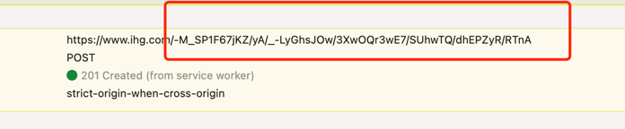
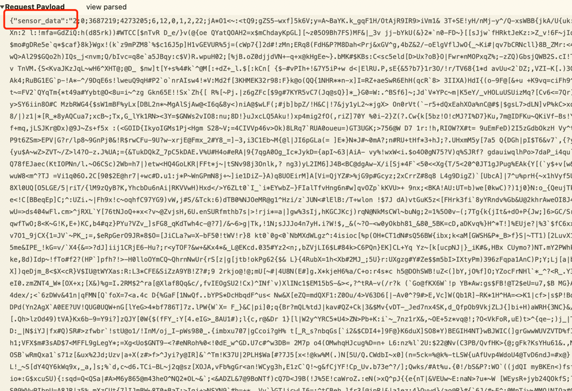
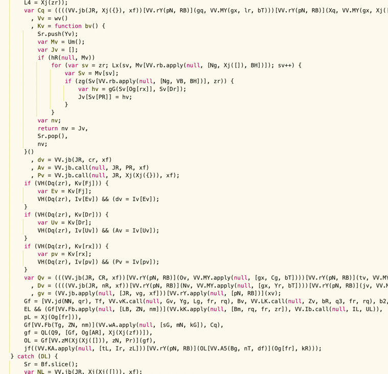
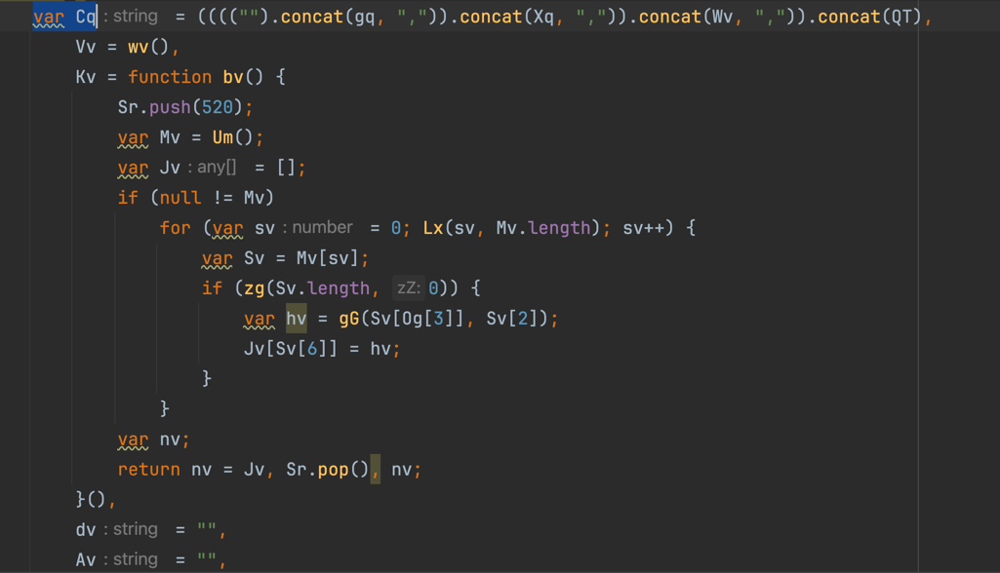
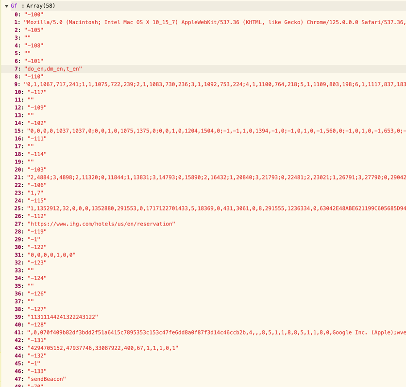
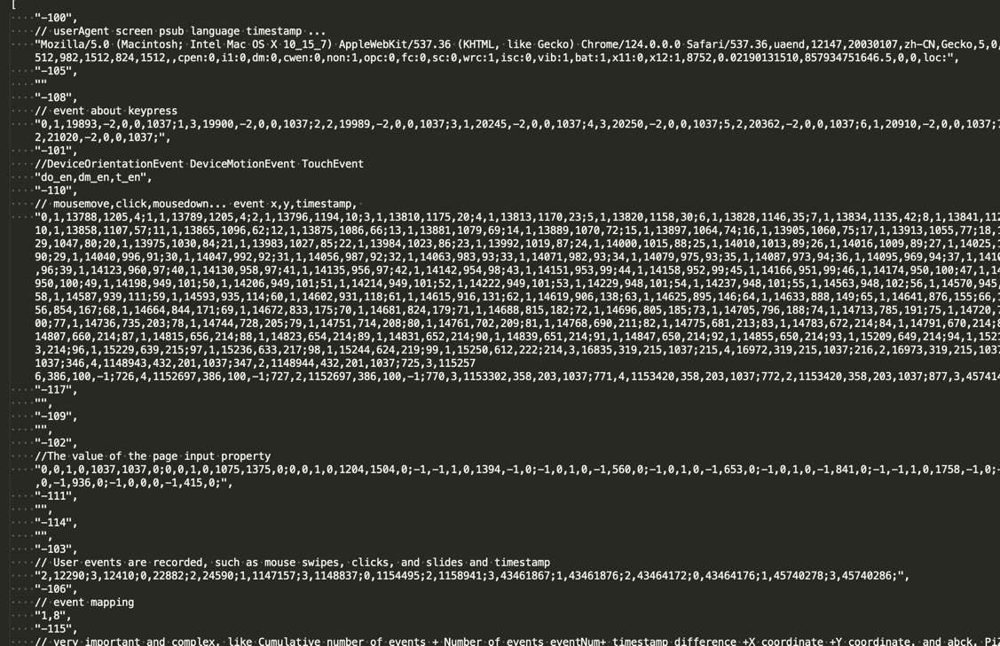

## **1.How do you know if your website is protected by akamai**

Through the url
The akamai website will have a url like this, which will change every day

[akamai's url,change every day ]

Through the cookie
If the cookie contains _abck,bm_sz,bm_mi, bm_sv

Througt the sensor_data
payload contains sensor_data

## **2.Analyze Akamai code and request data**

**1.Analyze akamai's js code for anti-obfuscation**

Akamai code is obfuscated and is impossible to read normally, but you can do this by de-obfuscating, replacing variables, array expressions, etc. with plain text, and the code will be clear and easy to read after processing.

before processing

after processing

**2.Learn about the sensor_data environment array**

Akamai's request parameters are encrypted inside sensor_data, which is actually a 58-length array that collects a lot of device, browser, and behavior information. Including userAgent, screen information, plug-in information, various event information, and so on.

sensor array:

Understand the information collected by the sensor_data array.It is necessary to know the meaning of each element in the array. This process requires reading the js code and knowing how the elements are collected. For example, the element after -100: userAgent + product + plguins number + product code + language + screen info + timestamp...
-105: the value of the page input property

**3.Request with sensor_data**

- To bypass tls, akamai's requests are ja3 fingerprint verification, which should be whitelisted against mainstream browser fingerprints, and if you are using a crawler, it will be blocked

- Request the url of the first step, if you use get request then you will get a js file. So use the post request, carrying your sensor_data if it returns true. Congratulations on your success, but this does not mean that you have gained the trust of Akamai, you will find that if you use the returned cookie to request data, many times will be blocked, especially if you send a large number of requests. Because the hardest thing about Akamai is risk control interception

**4.** Concurrent request data

- There are at least three layers of risk control, the first layer is the simplest risk control, Akamai checks your basic information such as userAgent, screen info, fixed canvas, permissions, language pack, etc

- The second level of risk control checks for random canvas fingerprints, webgl fingerprints, and so on about fingerprints

- The third layer of risk control is the hardest part, examining mouse tracks, click events, input events, etc., to determine whether you are a robot or an automated program

If you can pass these three layers of risk control checks, you can request data concurrently.

tools: [help to collect fingerprinters](https://github.com/NewStartMe/akamai-v2-browser-fingerprints)
discord:(https://discord.gg/EYpjeeeHFU)

 

